# 🚀 DevOps Modern End-to-End Deployment

## Final Project

**Author:** **Eziorobo John**

This project demonstrates a complete DevOps workflow by automating the deployment of multiple containerized applications on AWS using Infrastructure as Code, Configuration Management, Docker, and Jenkins CI/CD.

The project provisions AWS infrastructure with Terraform, configures the server with Ansible, deploys applications using Docker Compose, and automates the entire process through a Jenkins pipeline.

---

# Architecture Diagram

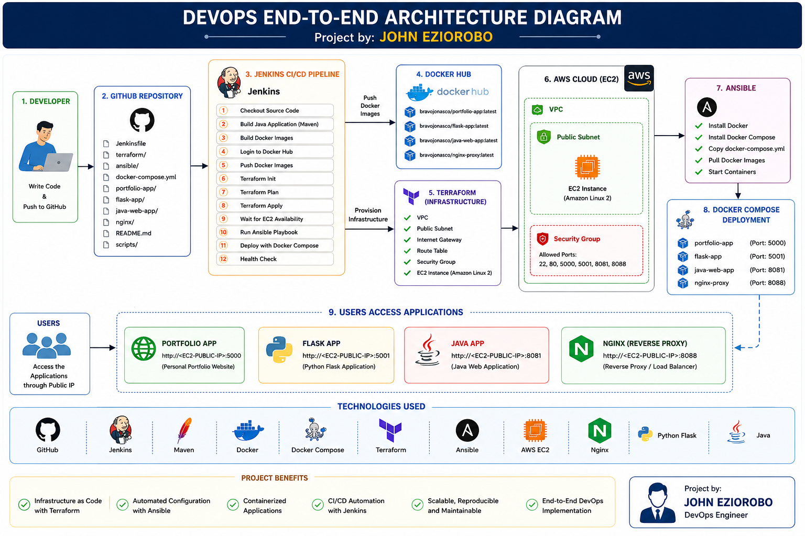

---

# Project Overview

This project deploys three containerized applications on an AWS EC2 instance.

- Portfolio Website (HTML/CSS + Nginx)
- Flask Web Application
- Java Web Application (Tomcat)
- Reverse Proxy using Nginx

The deployment is fully automated using:

- Terraform
- Docker
- Docker Compose
- Ansible
- Jenkins

---

# Technology Stack

| Tool | Purpose |
|-------|----------|
| AWS EC2 | Cloud Infrastructure |
| Terraform | Infrastructure as Code |
| Docker | Containerization |
| Docker Compose | Multi-container deployment |
| Ansible | Server Configuration |
| Jenkins | CI/CD Pipeline |
| GitHub | Source Code Repository |
| Maven | Java Build Tool |
| Nginx | Reverse Proxy |
| Flask | Python Web Application |
| Java/Tomcat | Java Web Application |

---

# Project Structure

```
john-devops-project
│
├── ansible/
├── flask-app/
├── java-web-app/
├── nginx/
├── portfolio-app/
├── terraform/
├── scripts/
├── screenshots/
├── docker-compose.yml
├── Jenkinsfile
└── README.md
```

### Project Structure

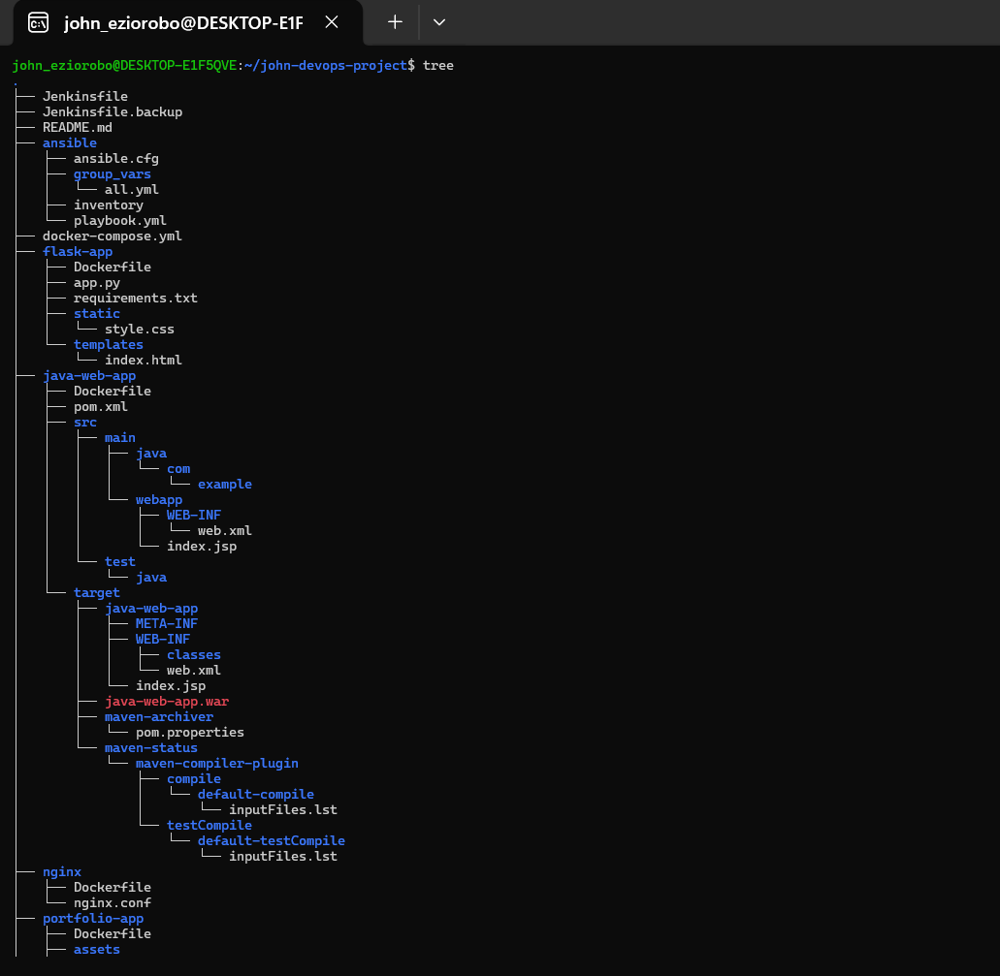

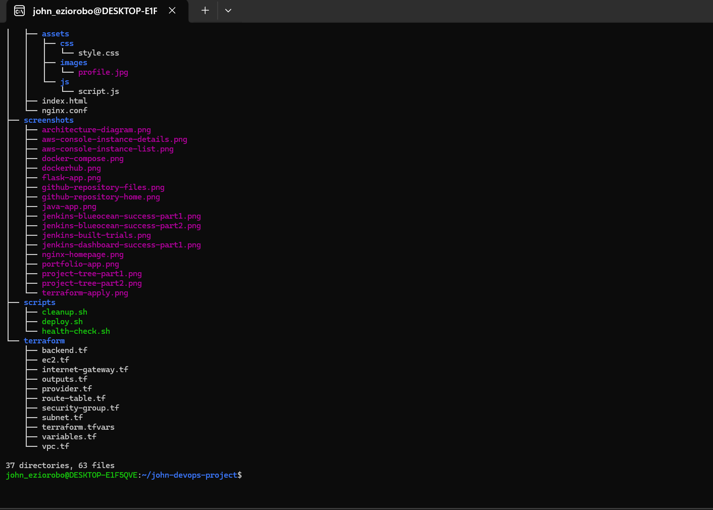

---

# Infrastructure Provisioning (Terraform)

Terraform automatically creates:

- VPC
- Public Subnet
- Internet Gateway
- Route Table
- Security Group
- EC2 Instance

Terraform Apply Output

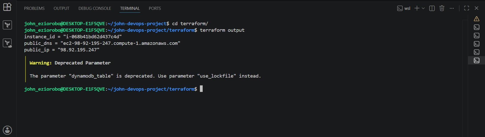

---

# Docker & Docker Compose

Docker images are built for:

- Portfolio Application
- Flask Application
- Java Application
- Nginx Reverse Proxy

Docker Compose then deploys all services automatically.

Docker Compose Running

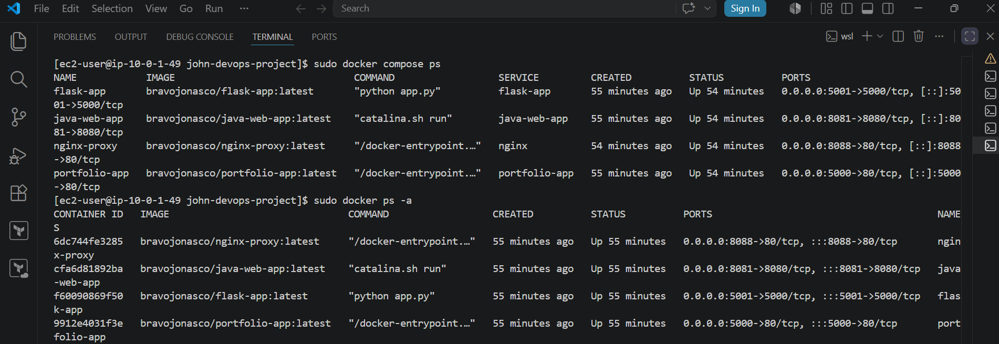

---

# Configuration Management (Ansible)

Ansible performs the following tasks:

- Installs Docker
- Installs Docker Compose
- Clones the GitHub repository
- Starts Docker services
- Deploys all applications automatically

---

# Jenkins CI/CD Pipeline

The Jenkins pipeline automates the entire deployment process.

Pipeline Stages:

- Checkout Source Code
- Verify Environment
- Build Java Application
- Build Docker Images
- Login to Docker Hub
- Push Docker Images
- Terraform Init
- Terraform Plan
- Terraform Apply
- Wait for EC2 SSH
- Create Dynamic Ansible Inventory
- Run Ansible Playbook
- Health Check

Jenkins Dashboard

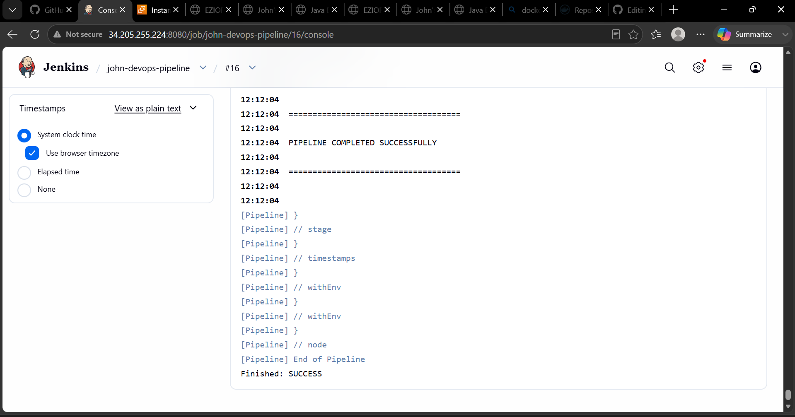

Blue Ocean Pipeline

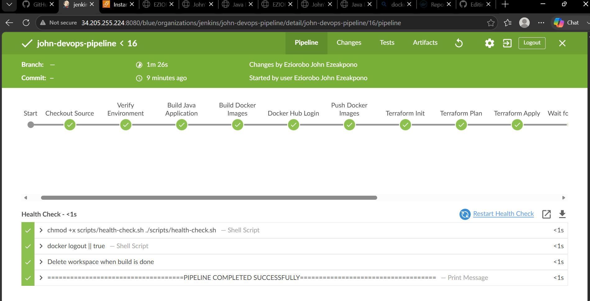

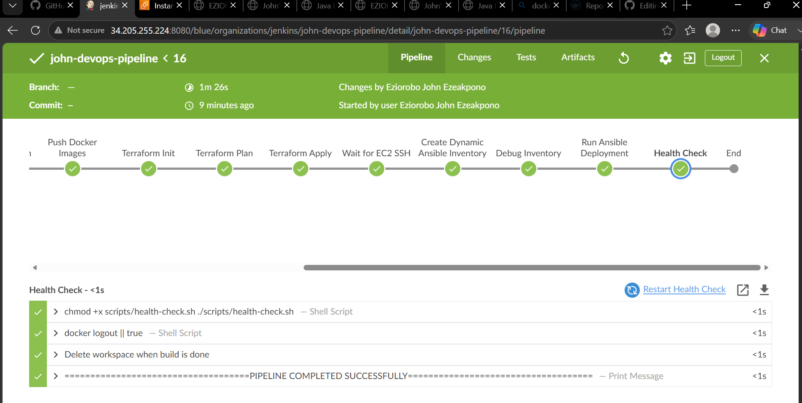

Pipeline Build History

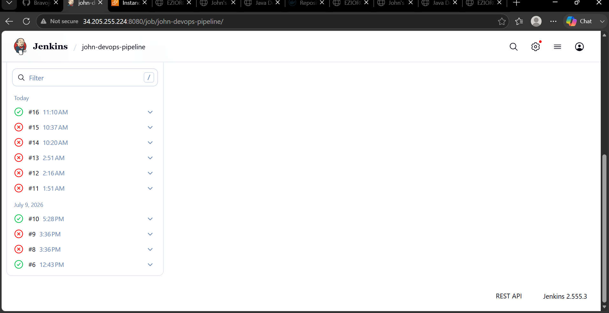

---

# AWS Infrastructure

AWS EC2 Instance List

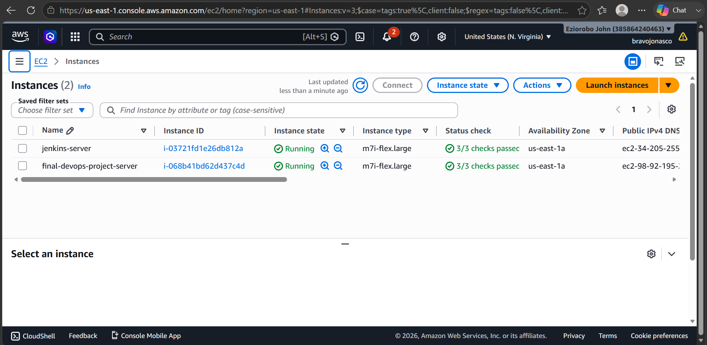

AWS EC2 Instance Details

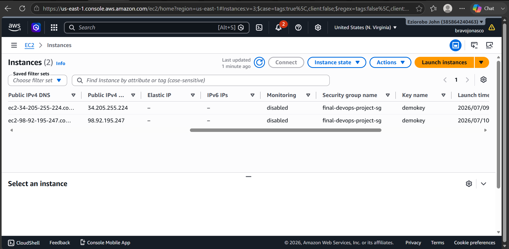

---

# Docker Hub Images

Docker images are pushed automatically to Docker Hub during every successful pipeline execution.

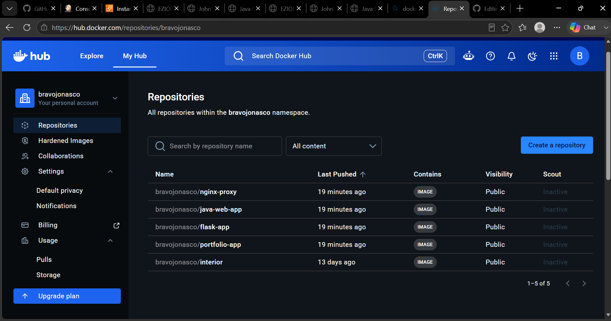

---

# GitHub Repository

Repository Home

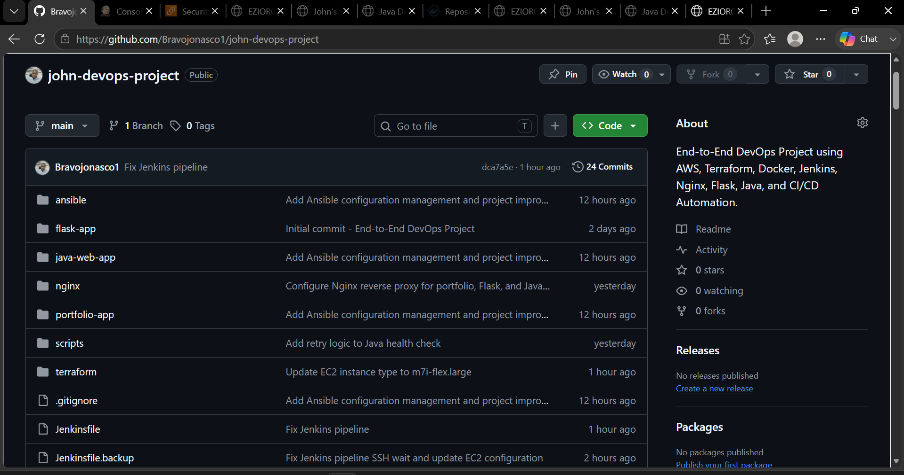

Repository Files

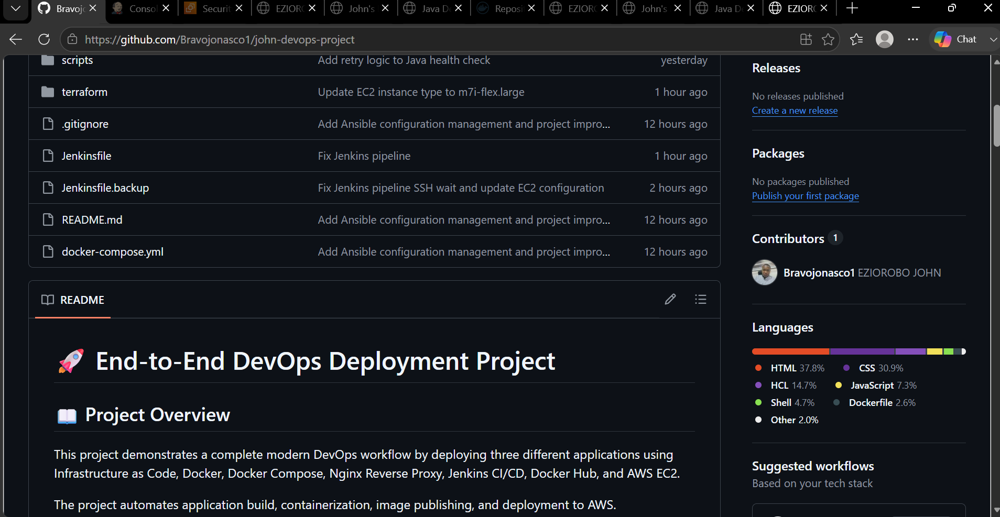

---

# Application URLs

| Application | URL |
|------------|-----|
| Portfolio Website | http://98.92.195.247:5000 |
| Flask Application | http://98.92.195.247:5001 |
| Java Application | http://98.92.195.247:8081 |
| Nginx Reverse Proxy | http://98.92.195.247:8088 |

---

# Application Screenshots

## Portfolio Website

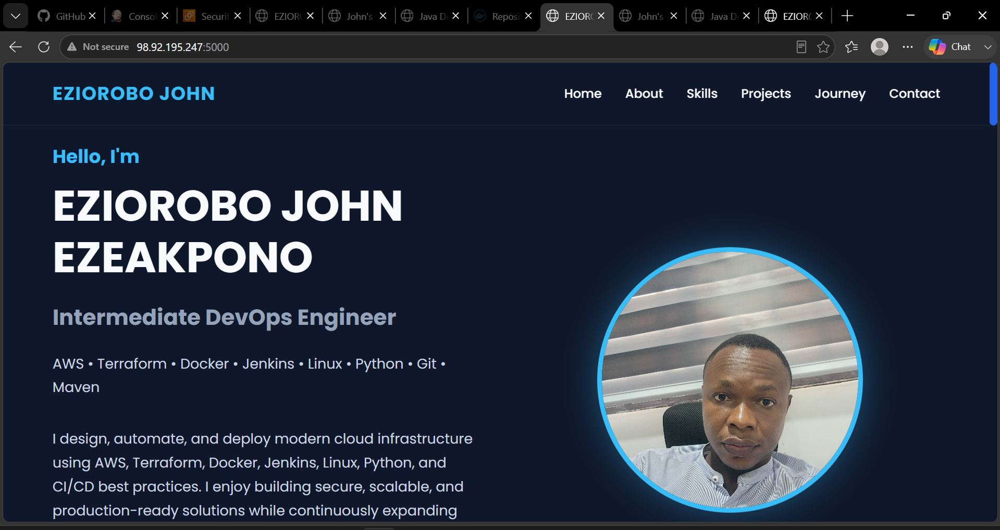

---

## Flask Application

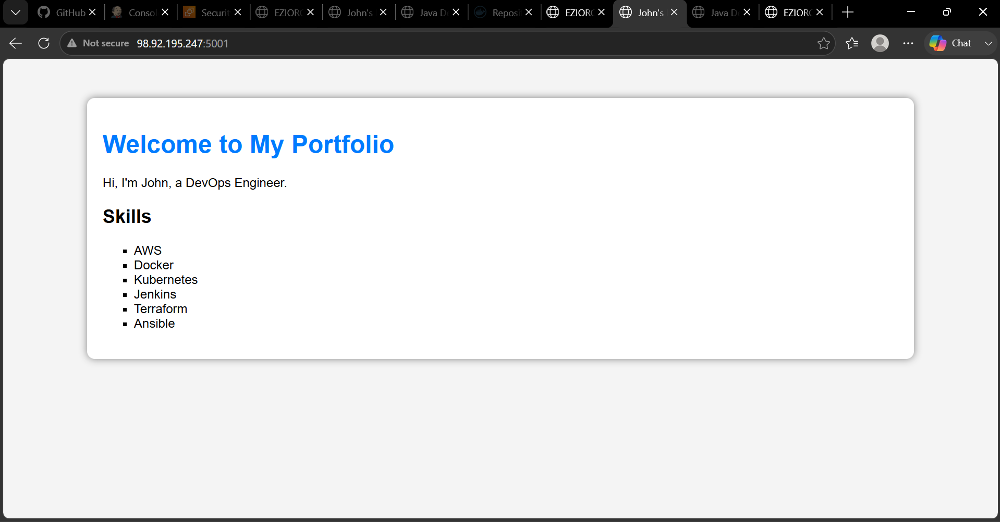

---

## Java Application

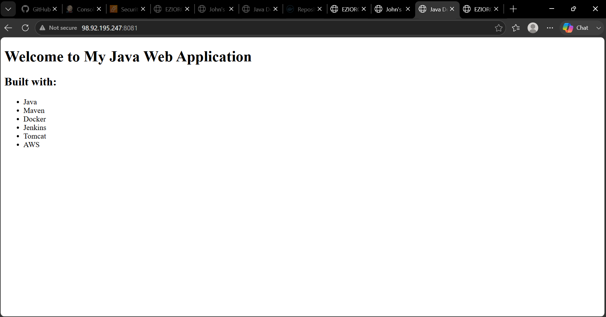

---

## Nginx Reverse Proxy

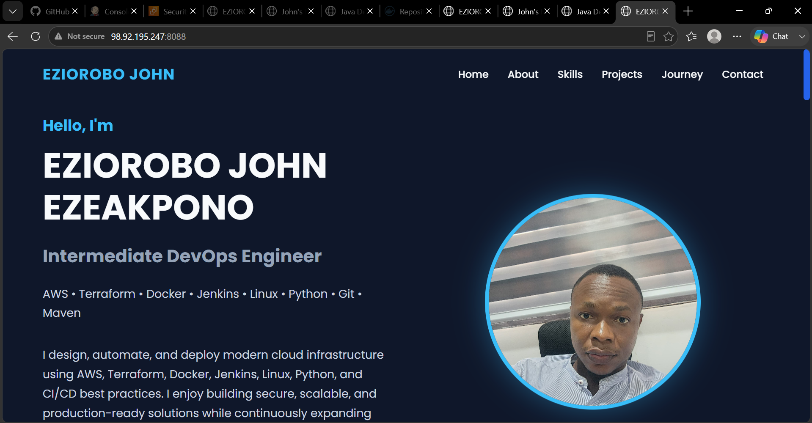

---

# Deployment Workflow

```
Developer

↓

GitHub Repository

↓

Jenkins Pipeline

↓

Build Java Application

↓

Build Docker Images

↓

Push Images to Docker Hub

↓

Terraform Creates AWS Infrastructure

↓

Ansible Configures EC2 Server

↓

Docker Compose Deploys Containers

↓

Applications Become Available
```

---

# Features

- Infrastructure as Code using Terraform
- Automated Server Configuration using Ansible
- Multi-container Deployment using Docker Compose
- Automated CI/CD using Jenkins
- Docker Hub Image Publishing
- Health Check Script
- Dynamic Ansible Inventory
- Fully Automated Deployment Pipeline

---

# Future Improvements

- HTTPS using Let's Encrypt
- Application Load Balancer
- Auto Scaling Group
- Monitoring with Prometheus & Grafana
- Kubernetes Deployment
- GitHub Actions Pipeline
- Multi-Environment Deployment

---

# Author

**Eziorobo John**

DevOps Engineer

GitHub: https://github.com/Bravojonasco1

---

# License

This project was developed for educational and portfolio purposes.
